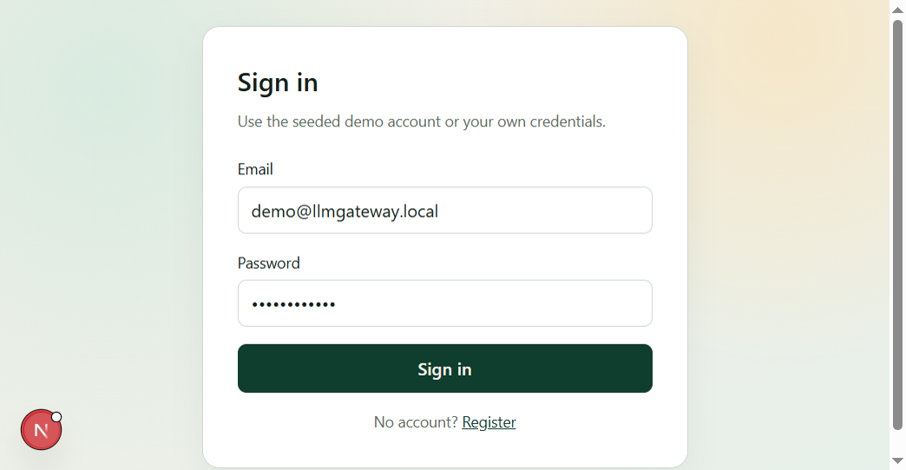
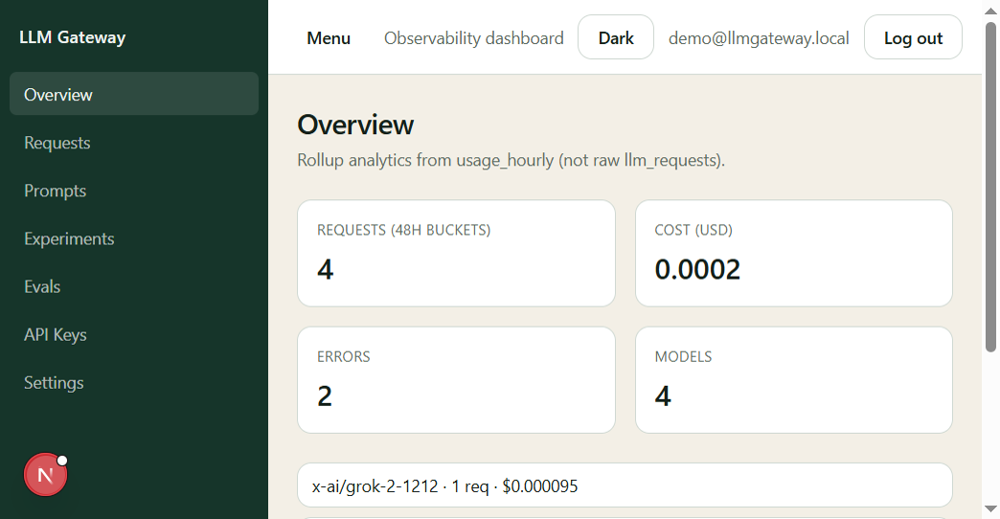
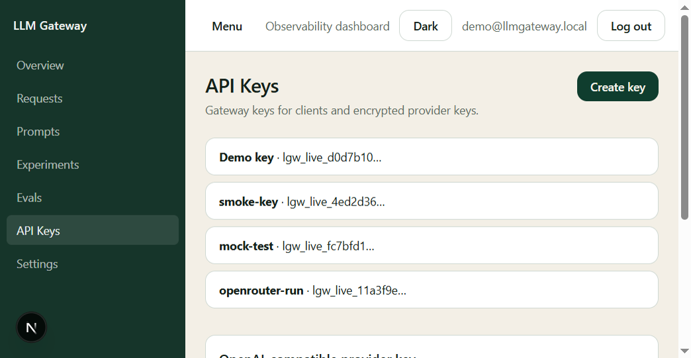
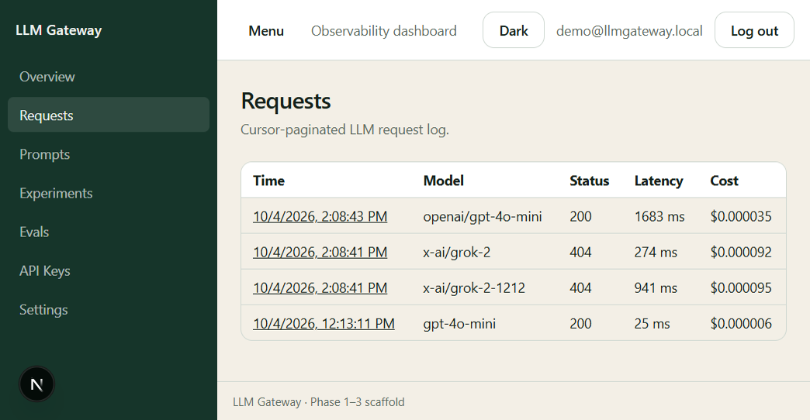

# LLM Gateway — UI screenshots

Captured from the local dashboard (`http://localhost:3000`) with the demo account.

## Screens

### 1. Sign in

- Route: `/login`
- Demo user: `demo@llmgateway.local` / `DemoPass123!`

### 2. Overview

- Route: `/overview`
- Hourly rollups: requests, cost, errors, models

### 3. API Keys

- Route: `/api-keys`
- Gateway keys (`lgw_live_…`) + OpenAI-compatible provider key (OpenRouter / Grok / Groq / OpenAI)

### 4. Requests

- Route: `/requests`
- Cursor-paginated proxy log (model, status, latency, cost)

## How to refresh screenshots

1. Start Postgres/Redis, API (`4010`), worker, and web (`3000`).
2. Sign in with the demo account.
3. Capture the four routes above and overwrite the PNGs in this folder.

## Related docs

- [Root README](../../README.md)
- [Architecture](../ARCHITECTURE.md)
- [API reference](../API.md)
